# 3. Laboratorio PPS (Kali, bWAPP, Mutillidae y DVWA)

## 3.1. Identificación de máquinas y puertos desde docker-compose

> Nos colocamos en la carpeta del escenario y lo levantamos
>
>```bash
>docker compose up -d
>```

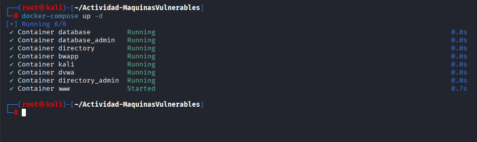

1. Abrimos el fichero `docker-compose.yml`.

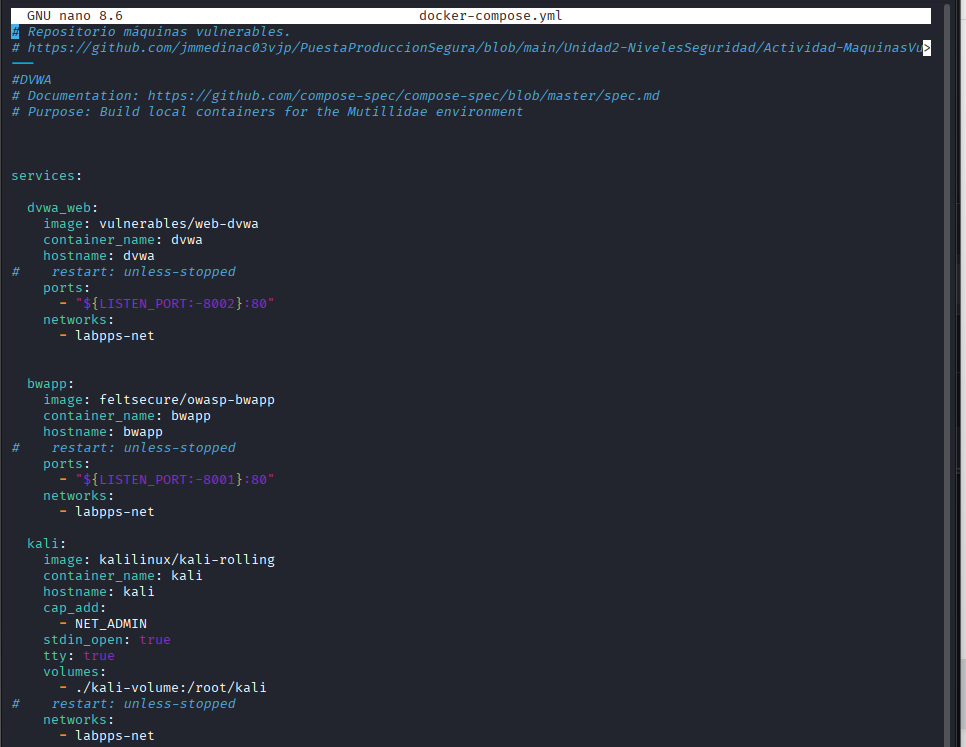

2. Completamos una tabla con:
   - Nombre del servicio (contenedor).
   - IP o red interna (si aparece).
   - Puertos expuestos (host:contenedor).
   - Aplicación (Kali, bWAPP, Mutillidae, DVWA).


| Servicio Docker | Aplicación   | Puerto host | Puerto contenedor | 
|-----------------|-------------|------------|-------------------|
| kali            | Kali Linux  | ---        |   ---             | 
| bwapp           | bWAPP       |8001        |   80              | 
| dvwa            | DVWA        |8002        |   80              | 
| mutillidae      | Mutillidae  |80          |                   | 


## 3.2. Obener información de equipos: Whois, DomainTools y Dnsrecon.

3. Obtenemos información pública del dominio `nestle.com` usando:
   - Comando `whois`.
   - Web de DomainTools (u otra similar como `whois.domaintools.com`).
   - Herramienta `dnsrecon`.

   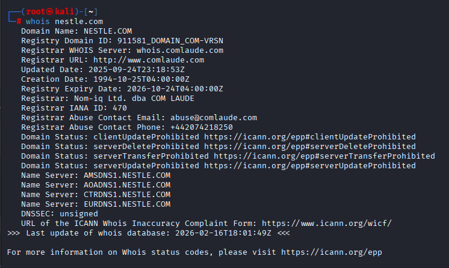

    Anota:
     - Registrador, fechas de creación y expiración.
     - Servidores DNS.
     - Registros DNS relevantes (A, MX, NS).
     ---
| Categoría                         | Detalle                                                                 |
|-----------------------------------|-------------------------------------------------------------------------|
| **Dominio**                       | nestle.com                                                              |
| **Registrador**                   | Nom-iq Ltd. dba COM LAUDE                                               |
| **Fecha de creación**             | 25 octubre 1994                                                         |
| **Fecha de última actualización** | 24 septiembre 2025                                                      |
| **Fecha de expiración**           | 24 octubre 2026                                                         |
| **Servidores DNS (NS)**           | amsdns1.nestle.com                                                      |
|                                   | aoadns1.nestle.com                                                      |
|                                   | ctrdns1.nestle.com                                                      |
|                                   | eurdns1.nestle.com                                                      |
| **Registros A**                   | 104.18.2.135                                                            |
|                                   | 104.18.3.135                                                            |
| **Registros AAAA**                | 2606:4700::6812:287                                                     |
|                                   | 2606:4700::6812:387                                                     |
| **Registro MX**                   | 10 nestle-com.mail.protection.outlook.com                               |
| **Registro CNAME**                | www.nestle.com → www.nestle.com.cdn.cloudflare.net                      |

4. DomainTools:

  - Accedemos a <https://whois.domaintools.com/nestle.com> e identificamos la misma información y posibles datos históricos.

  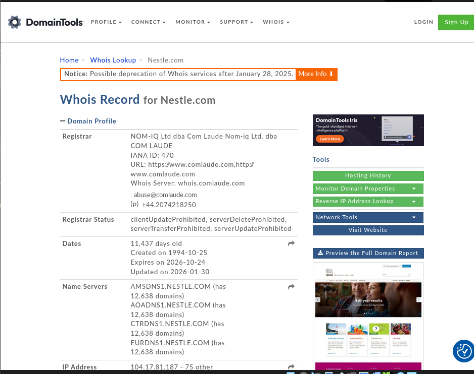

5. dnsrecon:

  - Obtén también la información de `Nestle.com`:

  - Registros `A`: IP principal o IPs asociadas al dominio.  
  - Registros `MX`: servidores de correo.  
  - Registros `NS`: servidores de nombres autoritativos.

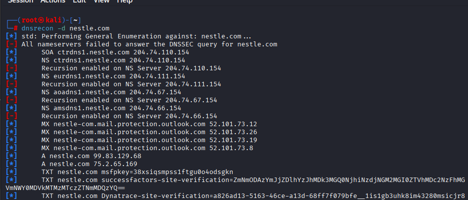

---

## 3.3 Detección de equipos, puertos, servicios y directorios y descubrimiento de vulnerabilidades: Nmap, nikto, Dirb, Searchsploit y Shotdan

Desde Kali:

1. Identifica todas las máquinas del laboratorio en la red virtual (por ejemplo, `172.22.0.0/24` o la que corresponda).  
  >
  > Para ello tenemos que acceder a la máquina de `kali` que tenemos allí para realizar las operaciones con Nmap:
  >
  >```bash
  >docker exec -it kali /bin/bash 
  >```
  > Instalamos los paquetes `net-tools` y `nmap`
  >
  >```bash
  >apt update; apt install net-tools nmap
  >```

  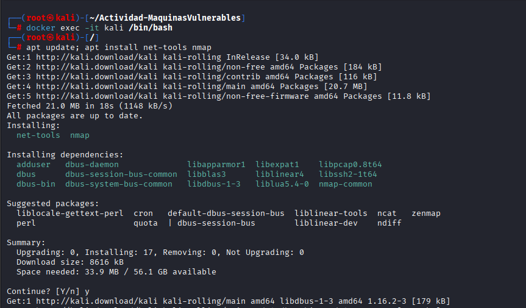

2. Escaneo de las máquinas presentes en la red de las máquinas vulnerables.

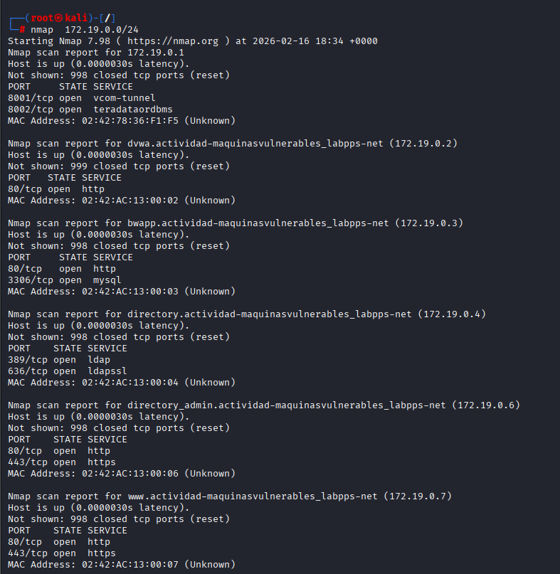

3. Detección de versiones y sistema operativo de cada una de ellas.

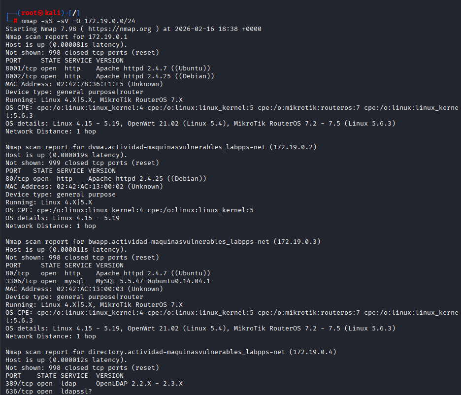

4. Ejecuta `nmap` con scripts de la categoría `vuln` sobre las máquinas del laboratorio.  

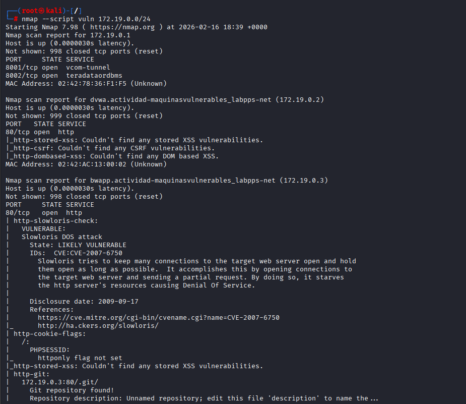

5. Identifica si se reporta alguna vulnerabilidad conocida (por ejemplo, CVEs).

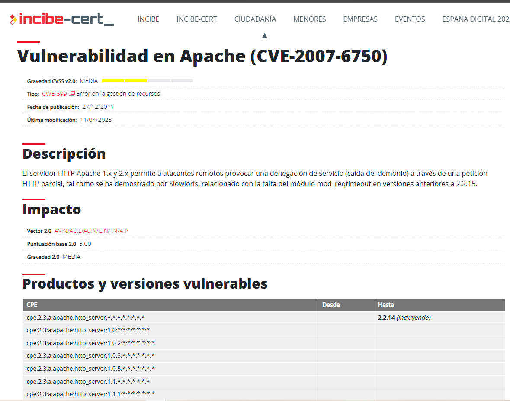

6. Ejecuta `nikto` para descubrir las vulnerabilidades de las máquinas del escenario multicontenedor de las máquinas vulnerables:
  - bWapp

  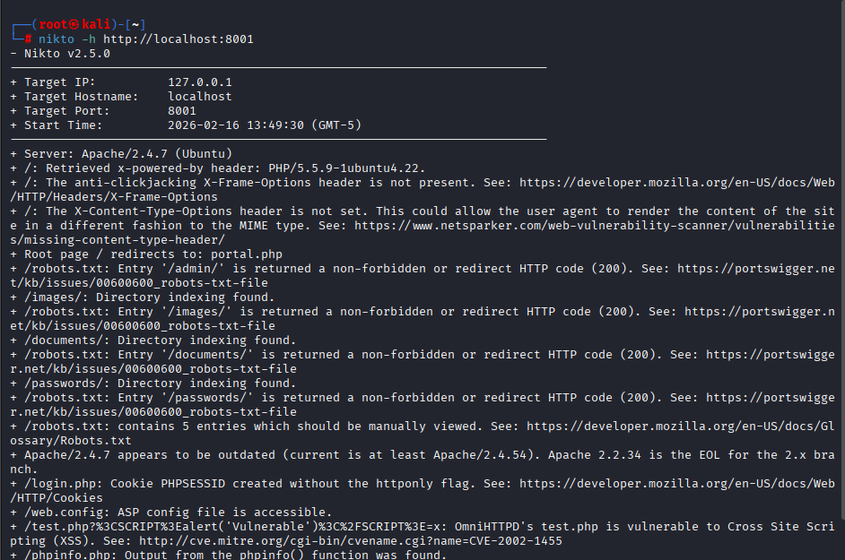

  - Multidillae ( Aquí guardamos el informe en formato html y lo visualizamos desde el navegador).

  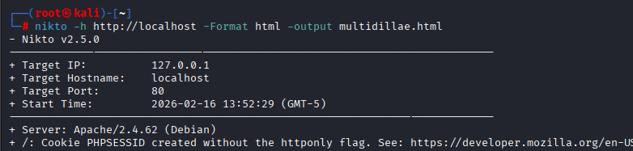

  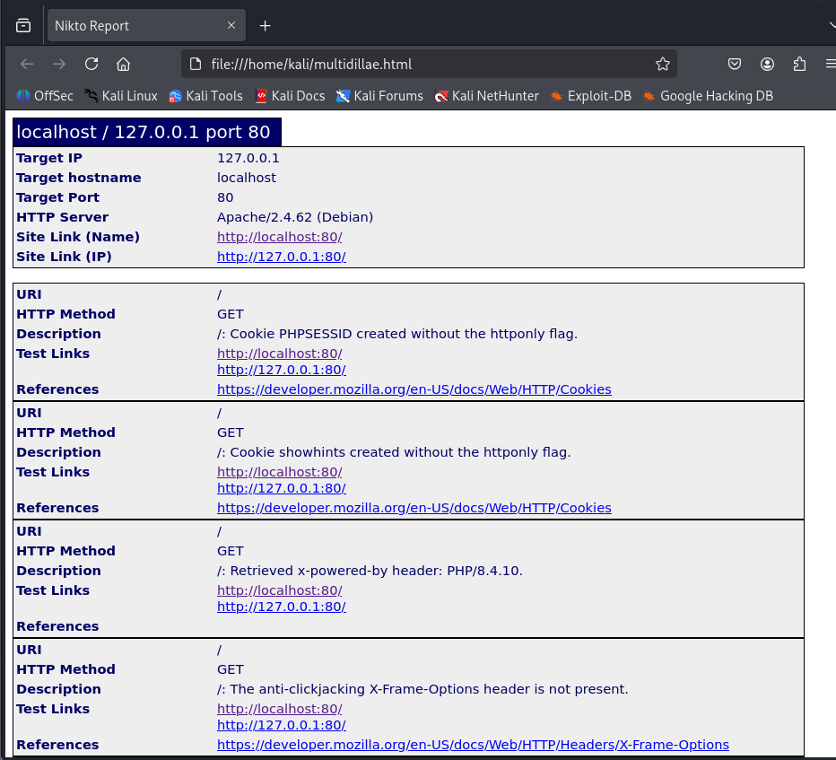


7. Descubre directorios ocultos en las máquina bWapp y Multidillae.

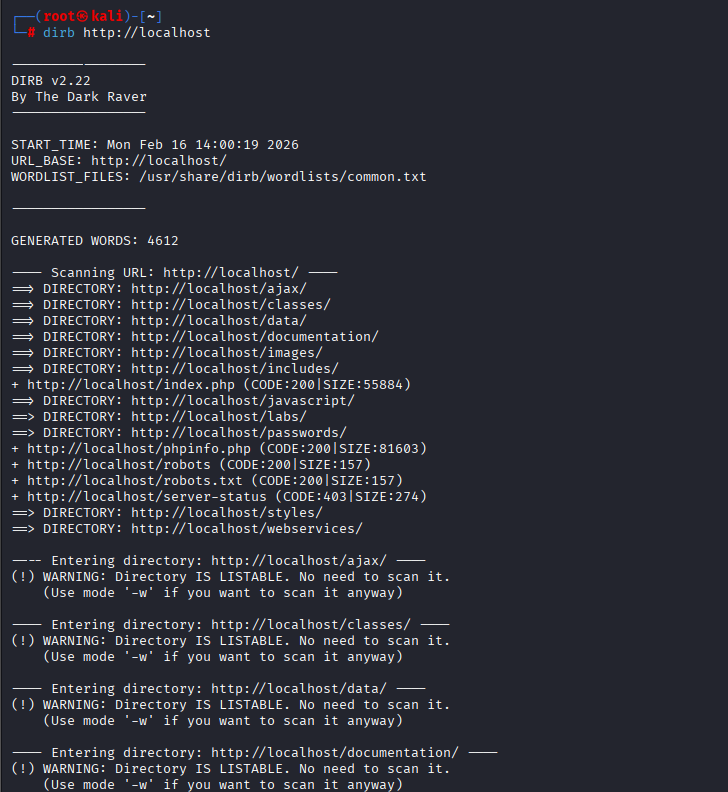

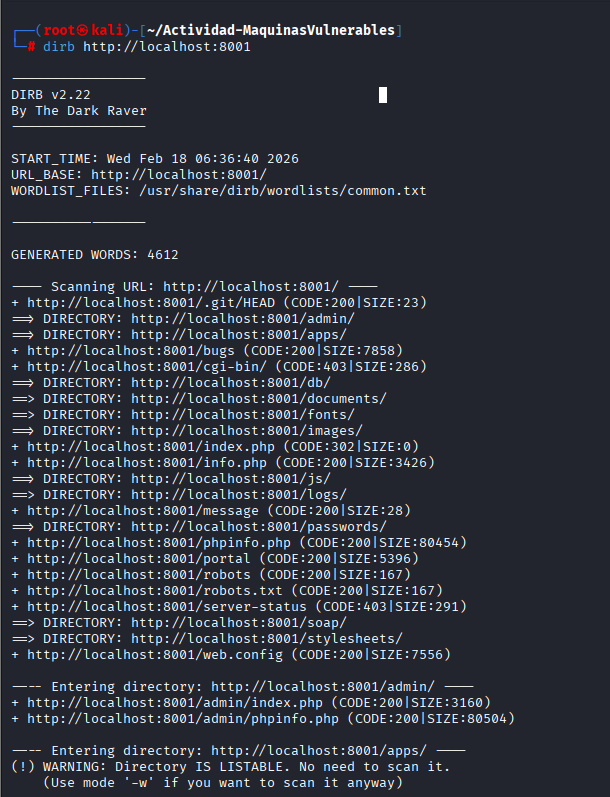

8. Busca con  `searchsploit` las vulnerabilidades relacionas con alguno de los servicios expuestos.  


9. Utiliza Dirb sobre las máquinas web del laboratorio para localizar directorios y recursos adicionales no visibles a simple vista.  

10. Instala la extensión de Shodan en tu navegador.

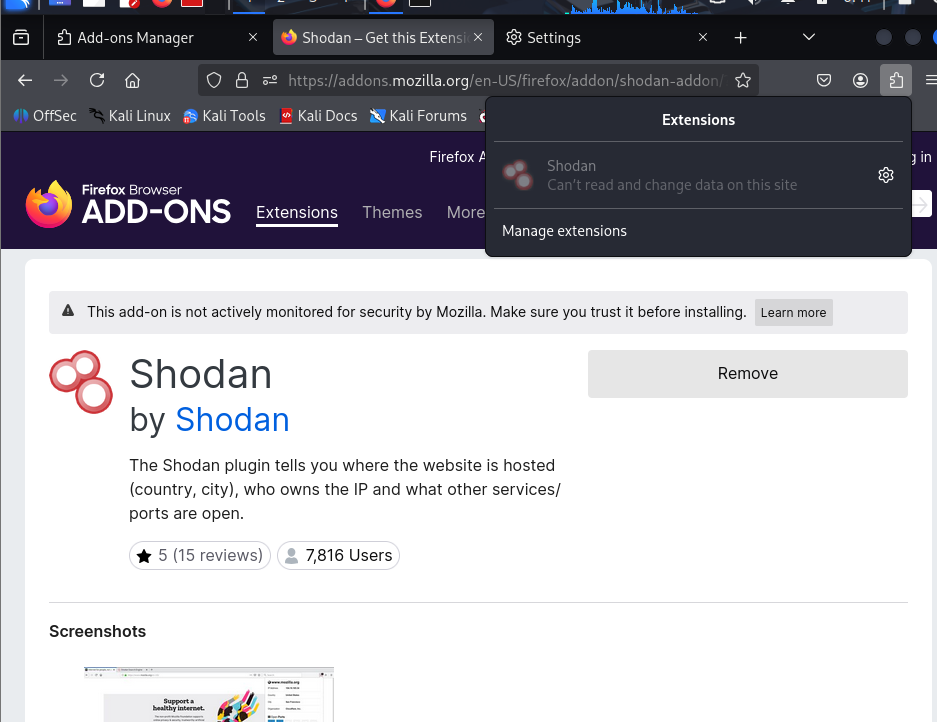

11. Abre la web `https://iesvallejertepla.educarex.es/`.

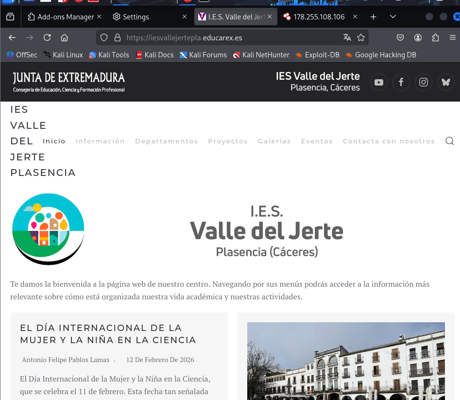

12. Muestra la información que proporciona Shodan sobre:
   - La IP pública del servidor.
   - Puertos y servicios identificados.
   - Potenciales vulnerabilidades o etiquetas de seguridad.

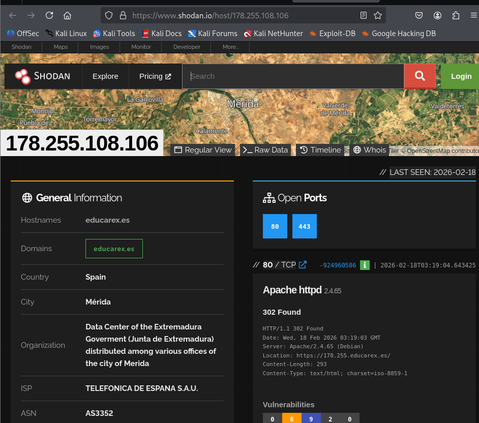
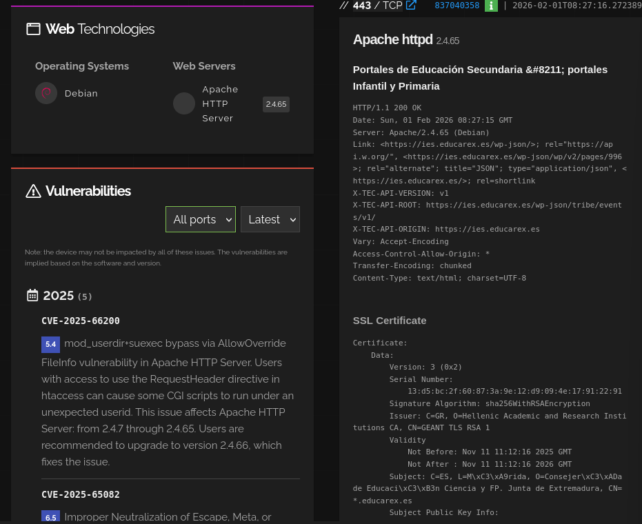
---
